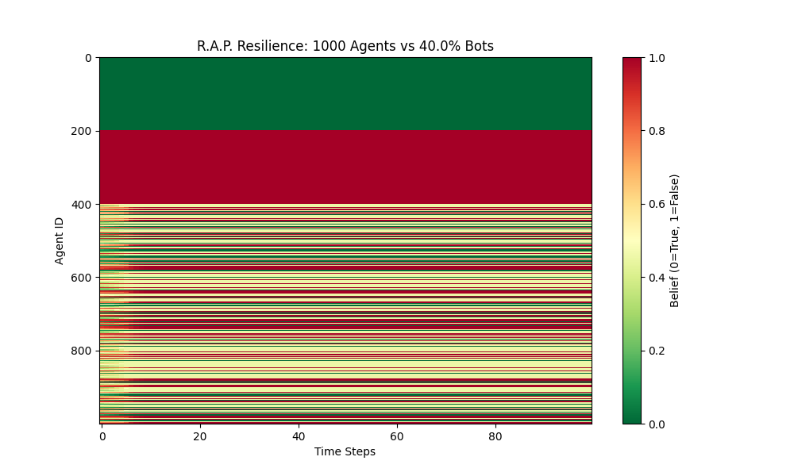
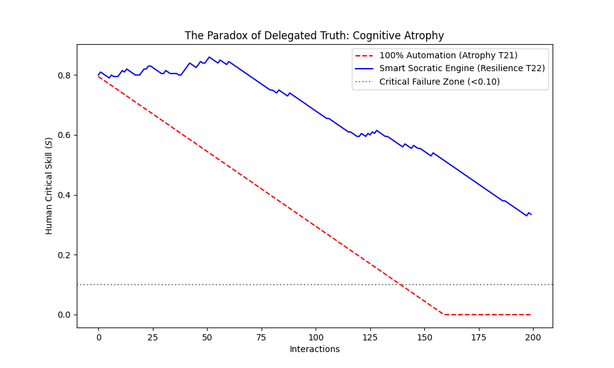

# The Reality Anchor Protocol (R.A.P.) simulations
**An Agent-Based Model investigation into Disinformation and Cognitive Resilience**

> *"Does perfect algorithmic safety inevitably lead to human cognitive atrophy?"*

## Project Overview
This repository hosts the Python simulation code and research papers produced by the **Computational Social Simulation Lab**. 

We set out to model a digital society ($N=1000$ agents) resistant to AI-generated disinformation. While testing a new technical architecture, our simulations uncovered a counter-intuitive psychological paradox regarding human reliance on automation.

## Documentation
* **[Part 1: The Architecture (PDF)](docs/Reality_Anchor_Protocol.pdf)** - A proposal for BFT-compliant social ranking using C2PA and Bridging Algorithms.
* **[Part 2: The Cognitive Risk (PDF)](docs/R.A.P._Addendum.pdf)** - Analysis of the "Epistemic Atrophy" phenomenon observed in simulations.

---

## Key Findings

### 1. The Technical Experiment (Resilience)
We modeled a network under attack by bot farms (>40% malicious nodes). We tested a "Defense in Depth" architecture combining:
* **Hardware Provenance:** Simulating C2PA/Secure Enclave checks.
* **Bridging-Based Ranking:** An algorithm that prioritizes cross-cluster consensus over raw engagement.

*Fig 1: Heatmap showing agent beliefs over time. Despite 40% malicious bots (Red block), the bridging algorithm prevents total contagion in the general population (Striped section).*

**Result:** The simulation suggests that replacing virality with bridging scores allows the network to maintain bounded consensus ($\Delta \le 0.47$) even under high stress conditions.

### 2. The Psychological Paradox (Atrophy)
During the stress tests, we tracked a variable representing human **Critical Skill** ($S$).

*Fig 2: Comparison of human critical skills over time. The Red line shows rapid decay under full automation. The Blue line shows sustained skill levels using the Socratic Engine.*

* **Observation:** When the algorithmic filters worked perfectly (100% protection), the simulated human agents reduced their verification efforts. Over time, $S$ decayed to near zero ($<0.10$), a state we call "Epistemic Atrophy".
* **Hypothesis:** A system that removes all friction may make the network technically safe but the users cognitively vulnerable.

### 3. Proposed Countermeasure: "Socratic Friction"
We tested a modified engine (Layer 2.5) that intentionally re-introduces friction.
* By challenging the user with verification tasks at a calculated rate (~40%), the simulation showed that agents maintained high critical skills ($S > 0.85$) without compromising system stability.

---

## Interactive Dashboard (https://reality-anchor-protocol-dashboard.streamlit.app/)

We have developed a real-time web interface to interact with the models and visualize real-world data.

# Features

## Social Data Analysis
The core system for monitoring and deconstructing digital narratives.

* **Universal Import**: Supports data ingestion from Facebook, X (Twitter), Instagram, and TikTok via CSV files, optimized for integration with browser extensions like Instant Data Scraper.
* **Native YouTube Scraper**: Automated extraction of comments directly from video URLs without the need for personal API keys.
* **Adaptive Personas**: Selection of different analytical profiles to examine data through specific lenses: Strategic Intelligence Analyst, Mass Psychologist, Legal Consultant, or Campaign Manager.
* **Psy-Ops Target Profiler**: Behavioral analysis and profiling of specific users to identify motivations, emotional triggers, and recurring linguistic patterns.
* **The Oracle**: A direct chat interface with the dataset for targeted queries regarding hate distribution, persuasive arguments, or identification of key actors.

## Comparison Test (A/B Testing)
Comparative analysis to map divergences in digital narratives.

* **Head-to-Head Comparison**: Simultaneous comparison between two different datasets or YouTube videos.
* **Metric Battle**: Immediate visualization of discrepancies in aggression levels, presence of automated accounts (bots), and frequency of logical fallacies between opposing sources.

## Wargame Room (Live Simulation)
A simulation environment for studying the spread of information and disinformation.

* **Real-Time Info-War Simulator**: Modeling the propagation of disinformation via reactive heatmaps and infection graphs.
* **Network Topologies**: Configurable scenarios including Public Square, Echo Chambers, or Influencer Network.
* **Blue Team Countermeasures**: Simulation of the impact of active defenses such as Targeted Debunking, Algorithmic Dampening, or Hard Bans on the diffusion curve.

## Cognitive Editor and Forensics (Multimodal)
Advanced tools for multimedia content analysis and integrity verification.

* **Vision Guard and Deepfake Scanner**: Analysis of images and videos for detecting digital manipulation, AI upscaling, and face-swapping.
* **Forensic Video Timeline**: Temporal analysis to locate AI alterations frame-by-frame across the video length.
* **Voice Intel**: Processing of audio files for the analysis of tone, prosody, and emotion to detect non-textual sarcasm or aggression.
* **Shadow Geolocation**: Deduction of geographic location through the analysis of visual micro-clues such as architecture, signage, vegetation, and local brands (GeoINT).
* **Syllogism Machine**: Logical deconstruction of speech into premises and conclusions to identify the exact breaking point of an argument.
* **Auto-Sanitize**: Automatic rewriting of toxic or fallacious text into neutral, logical, and fact-based versions.

## Deep Document Oracle (RAG)
Massive analysis of complex textual documents.

* **Document Analysis**: Processing of large PDF files for logical scanning and fact extraction.
* **Knowledge Graph**: Automatic generation of relational maps between people, organizations, and locations mentioned in documents to visualize networks of power and influence.

## Enterprise Reporting
Output tools for the production of strategic intelligence.

* **Hybrid Truth Engine**: Powered by Google Gemini, performing three-level scans focused on logical validity, factual accuracy, and emotional spectrum.
* **Bot Hunter**: Heuristic detection of coordinated inauthentic behavior and spam networks.
* **Export Ready**: Generation of professional reports in Excel or PDF formats containing executive summaries, fallacy distribution charts, and filtered word clouds.

### How to Run Locally

    # 1. Install dependencies
    pip install -r requirements.txt

    # 2. Launch the Dashboard
    streamlit run app.py

---

## Repository Structure

| File | Description |
| :--- | :--- |
| `app.py` | **Main Dashboard application**. Interactive Streamlit interface. |
| `moltbook_REAL_data.csv` | Dataset containing real agent interactions from the Moltbook archive. |
| `src/01_rap_bft_simulation.py` | Simulates the network resilience against bot swarms (Hegselmann-Krause dynamics). |
| `src/02_cognitive_atrophy.py` | Models the decay of human critical skills under total automation vs. Socratic Friction. |
| `download_moltbook.py` | Script to fetch and clean fresh data from the Moltbook Observatory. |
| `output/` | Contains the generated graphs (`fig1`, `fig2`). |

---

## Contributing

This is an experimental research project. We welcome forks, pull requests, and alternative modeling approaches to challenge our parameters.

