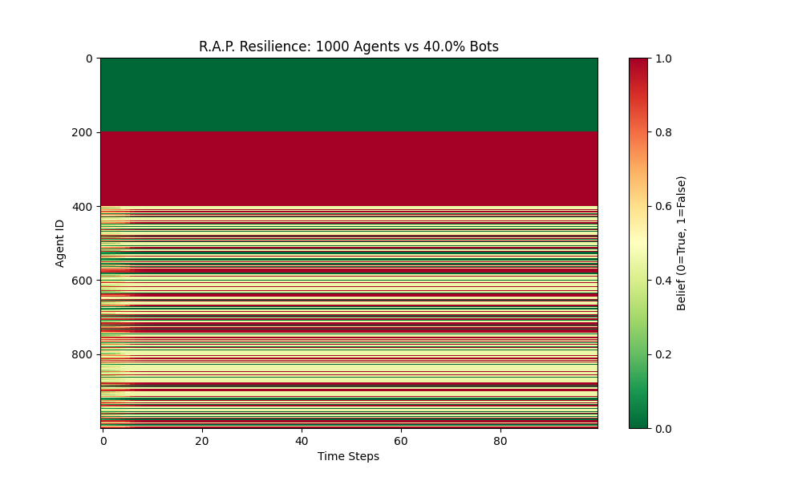
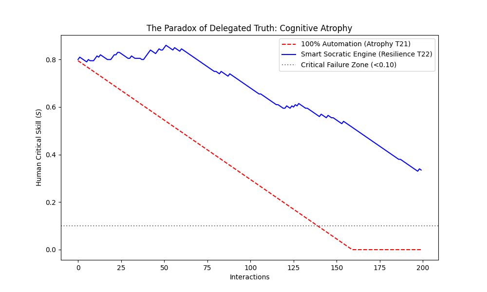

# The Reality Anchor Protocol (R.A.P.) simulations
**An Agent-Based Model investigation into Disinformation and Cognitive Resilience**

> *"Does perfect algorithmic safety inevitably lead to human cognitive atrophy?"*

## Project Overview
This repository hosts the Python simulation code and research papers produced by the **Computational Social Simulation Lab**. 

We set out to model a digital society ($N=1000$ agents) resistant to AI-generated disinformation. While testing a new technical architecture, our simulations uncovered a counter-intuitive psychological paradox regarding human reliance on automation.

## Documentation
* **[Part 1: The Architecture (PDF)](docs/Reality_Anchor_Protocol.pdf)** - A proposal for BFT-compliant social ranking using C2PA and Bridging Algorithms.
* **[Part 2: The Cognitive Risk (PDF)](docs/R.A.P._Addendum.pdf)** - Analysis of the "Epistemic Atrophy" phenomenon observed in simulations.

---

## Key Findings

### 1. The Technical Experiment (Resilience)
We modeled a network under attack by bot farms (>40% malicious nodes). We tested a "Defense in Depth" architecture combining:
* **Hardware Provenance:** Simulating C2PA/Secure Enclave checks.
* **Bridging-Based Ranking:** An algorithm that prioritizes cross-cluster consensus over raw engagement.

*Fig 1: Heatmap showing agent beliefs over time. Despite 40% malicious bots (Red block), the bridging algorithm prevents total contagion in the general population (Striped section).*

**Result:** The simulation suggests that replacing virality with bridging scores allows the network to maintain bounded consensus ($\Delta \le 0.47$) even under high stress conditions.

### 2. The Psychological Paradox (Atrophy)
During the stress tests, we tracked a variable representing human **Critical Skill** ($S$).

*Fig 2: Comparison of human critical skills over time. The Red line shows rapid decay under full automation. The Blue line shows sustained skill levels using the Socratic Engine.*

* **Observation:** When the algorithmic filters worked perfectly (100% protection), the simulated human agents reduced their verification efforts. Over time, $S$ decayed to near zero ($<0.10$), a state we call "Epistemic Atrophy".
* **Hypothesis:** A system that removes all friction may make the network technically safe but the users cognitively vulnerable.

### 3. Proposed Countermeasure: "Socratic Friction"
We tested a modified engine (Layer 2.5) that intentionally re-introduces friction.
* By challenging the user with verification tasks at a calculated rate (~40%), the simulation showed that agents maintained high critical skills ($S > 0.85$) without compromising system stability.

---

## Interactive Dashboard (https://reality-anchor-protocol-dashboard.streamlit.app/)

We have developed a real-time web interface to interact with the models and visualize real-world data.

# Features

## Social Data Analysis
The core system for monitoring and deconstructing digital narratives and identifying threats.

* **Global Multilingual Processing**: Native support for processing unstructured input text in any language (including slang, dialects, and non-Latin alphabets). Users can force the AI to translate and output all forensic analysis, explanations, and strategic summaries strictly into 14 different selectable target languages (English, Italian, Spanish, Arabic, Russian, Chinese, etc.).
* **Universal Import**: Supports data ingestion via CSV (for Facebook, X, Instagram, TikTok), raw text paste, native YouTube URL scraping, direct Telegram JSON dump decryption, and Native Reddit OSINT extraction.
* **Adaptive Personas**: Selection of different analytical profiles to examine data through specific lenses: Strategic Intelligence Analyst, Mass Psychologist, Legal Consultant, Campaign Manager, or Custom Roles.
* **Action Deck Generator**: Automated drafting of response strategies based on selected comments, including Counter-Narrative Threads, Official Statements, Legal Risk Assessments, and Engagement Strategies.
* **Psy-Ops Target Profiler**: Behavioral analysis and profiling of specific users to identify motivations, emotional triggers, and recurring linguistic patterns.
* **High-Value Targets (HVT) Identification**: Algorithmic detection of "Patient Zero" or chief propagandists based on toxicity, logical fallacies, and network impact/likes.
* **Cross-Entity Resolution (Global Memory Check)**: Automatic cross-referencing that triggers an alert if actors or targets found in social data match classified entities extracted by the Deep Document Oracle.
* **Dynamic Timeline Filter**: Interactive, minute-by-minute visualization of aggression peaks and narrative escalation over time.
* **The Oracle**: A direct chat interface with the dataset for targeted queries regarding hate distribution, persuasive arguments, or identification of key actors.

## Comparison Test (A/B Testing)
Comparative analysis to map divergences in digital narratives.

* **Head-to-Head Comparison**: Simultaneous comparison between two different datasets, text dumps, or YouTube videos.
* **Metric Battle**: Immediate visualization of discrepancies in aggression levels, presence of automated accounts (bots), and frequency of logical fallacies between opposing sources.
* **Comparative Battle Report**: Exportable PDF tactical dossier detailing the comparative metrics and automatically concluding which narrative poses the highest polarization risk.

## Wargame Room (Live Simulation)
A simulation environment for studying the spread of information and disinformation.

* **Real-Time Info-War Simulator**: Modeling the propagation of disinformation via reactive heatmaps and infection graphs.
* **Network Topologies**: Configurable scenarios including Public Square, Echo Chambers, or Influencer Network.
* **Blue Team Countermeasures**: Simulation of the impact of active defenses such as Targeted Debunking, Algorithmic Dampening, or Hard Bans on the diffusion curve.
* **Tactical Simulation Report**: Instant generation of a PDF dossier capturing the simulation parameters, net variation (Delta), and an AI-driven strategic assessment of the countermeasure's success.

## Cognitive Editor and Forensics (Multimodal)
Advanced tools for multimedia content analysis, OSINT, and integrity verification.

* **Vision Guard and Deepfake Scanner**: Analysis of images and videos for detecting digital manipulation, AI generation, and physical impossibilities.
* **Forensic Video Timeline**: Temporal analysis to locate AI alterations frame-by-frame across the video length.
* **Voice Intel**: Processing of audio files for the analysis of tone, prosody, and emotion to detect non-textual sarcasm, voice stress, or aggression.
* **EXIF OSINT & Shadow Geolocation**: Extraction of hidden metadata (creation dates, software used) and GPS coordinates for interactive mapping, combined with visual micro-clue deduction (architecture, signage) for locations without metadata.
* **OPSEC Metadata Scrubber**: A one-click sanitization tool that strips all invisible EXIF/GPS data from an image before sharing it as evidence.
* **Syllogism Machine**: Logical deconstruction of speech into formal premises and conclusions to identify the exact breaking point of an argument.
* **Auto-Sanitize**: Automatic transcription and rewriting of toxic or fallacious text into neutral, logical, and fact-based versions (matching the source language automatically).

## Live Radar (Crisis Alert System)
Real-time interception of escalating disinformation and aggression.

* **Live Feed Interception**: Continuous monitoring of news RSS feeds, specific keywords, or live Subreddits.
* **Automated Threat Assessment**: Batch processing of incoming news to calculate the "Live Aggression Index" and flag dangerous polarization.
* **Emergency Dispatch**: Automated Webhook/Slack or Email alert triggers if the global aggression index spikes above critical thresholds (8.0/10).

## Deep Document Oracle (RAG)
Massive analysis of complex textual documents and intelligence reports.

* **Deep Document Analysis**: Processing of massive PDF files (manifestos, contracts, books) utilizing an extended context window for logical scanning and fact extraction.
* **PII Sanitizer**: Automated redaction of Personally Identifiable Information (Emails, IP Addresses, IBANs, Phone Numbers) prior to AI analysis.
* **Contradiction & Loophole Scanner**: A ruthless forensic audit that scans entire documents to find internal contradictions, legal loopholes, and unfulfilled claims, complete with exact page citations.
* **Knowledge Graph & Global Memory**: Automatic generation of relational networks between people, organizations, and locations, permanently registering them into the system's "Global Memory" for cross-module threat detection.

## Enterprise Reporting
Universal output tools for the production of strategic intelligence.

* **Hybrid Truth Engine**: Powered by Google Gemini models, performing three-level scans focused on logical validity, factual accuracy, and emotional spectrum.
* **Bot Hunter**: Heuristic detection of coordinated inauthentic behavior, duplicate content propagation, and high-frequency spam networks.
* **Universal PDF Reporting**: Generation of professional, formatted PDF executive summaries and tactical dossiers from *every single module* (Social, Wargame, Arena, Radar), ready for international teams.
* **Forensic Chain of Custody**: Generation of detailed TXT Forensic Dossiers for multimedia files, secured with SHA-256 cryptographic hashing to ensure legal evidence integrity.
* **Excel Data Export**: Downloadable Excel reports containing executive summaries, fallacy distribution charts, and full raw datasets.

### How to Run Locally

    # 1. Install dependencies
    pip install -r requirements.txt

    # 2. Launch the Dashboard
    streamlit run app.py

---

## Repository Structure

| File | Description |
| :--- | :--- |
| `app.py` | **Main Dashboard application**. Interactive Streamlit interface. |
| `moltbook_REAL_data.csv` | Dataset containing real agent interactions from the Moltbook archive. |
| `src/01_rap_bft_simulation.py` | Simulates the network resilience against bot swarms (Hegselmann-Krause dynamics). |
| `src/02_cognitive_atrophy.py` | Models the decay of human critical skills under total automation vs. Socratic Friction. |
| `download_moltbook.py` | Script to fetch and clean fresh data from the Moltbook Observatory. |
| `output/` | Contains the generated graphs (`fig1`, `fig2`). |

---

## Contributing

This is an experimental research project. We welcome forks, pull requests, and alternative modeling approaches to challenge our parameters.

